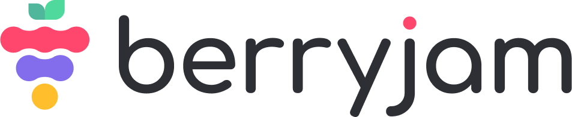

<div align="center">
  <picture>
    <source media="(prefers-color-scheme: dark)" srcset="./assets/img/berryjam_logo_dark.png">
    
  </picture>
  
  <br />
  <hr/>
  Scan your Vue.js codebase for component visibility and actional insights.
  <br/><br/>
  Berryjam is a Vue.js component analytics tool to scan your project for components to monitor their usages. Component visibility allows for effective team communication and provides opportunities to optimize your source code.
  <br/><br/>
  Currently supporting JavaScript / TypeScript and Vue.js (2.5.X and above). The CLI scan is more accurate on TypeScript project and does not yet support Nuxt.
  <br/><br/>
  
  [Overview](#sunglasses-overview) - [Quick Start (to Web Documentation)](#) - [Community](#busts_in_silhouette-community) - [Support (to Berryjam Discord)][discord] - [License](#books-license)
  
  [](LICENSE.md)
  [][discord]
  [][twitter] 
</div>

## :sunglasses: Overview

Berryjam scans for components in your source code to output a JSON file. Here is a sample JSON: 

<details>
  <summary>Simple JSON</summary>

```javascript
[
	{
    	"tag": "Overlay",
    	"total": 1,
    	"tagType": "",
    	"dependencies": {},
    	"tagFrom": "@/components/ui/Overlay.vue",
    	"details": [
      		{
				"tag": "Overlay",
				"source": "/Users/name/folder/koel-master/resources/assets/js/App.vue",
				"rows": [
					2
				],
				"property": {
				"dataLastModified": "",
				"lastModified": "",
				"created": ""
				},
				"total": 1
			}
		],
			"tagProperty": {
				"dataLastModified": "",
				"lastModified": "",
				"created": ""
			},
			"children": {
				"total": 0,
				"tags": [],
				"source": ""
			}
		},
	{
		"tag": "DialogBox",
		"total": 1,
		"tagType": "",
		"dependencies": {},
		"tagFrom": "@/components/ui/DialogBox.vue",
		"details": [
		{
			"tag": "DialogBox",
			"source": "/Users/name/folder/koel-master/resources/assets/js/App.vue",
			"rows": [
				3
			],
			"property": {
			"dataLastModified": "",
			"lastModified": "",
			"created": ""
			},
			"total": 1
		}
		],
			"tagProperty": {
				"dataLastModified": "",
				"lastModified": "",
				"created": ""
			},
			"children": {
				"total": 0,
				"tags": [],
				"source": ""
			}
	},
];
```
</details>
After the scan, Berryjam triggers your Analytic Dashboard for transparency and insights. Here is a sample Dashboard: 

## :busts_in_silhouette: Community

- [Twitter][twitter]: Follow our official Twitter account
- [Discord][discord]: A place where you can get support, feedback or just want to meet and hang out. 
- [GitHub](https://github.com/logicspark/berryjam): If you wish, you may want to request features here too. 
- For any other inquiries, you may reach out to us at connect@berryjam.dev. 

## :books: License

Berryjam code is licensed under the terms of the [Elastic License 2.0](LICENSE.md) (ELv2), which means you can use it freely inside your organization to protect your applications without any commercial requirements.

You are not allowed to provide Berryjam to third parties as a hosted or managed service without explicit approval.

---

[discord]: https://discord.gg/8SgTS4QdCd
[twitter]: https://twitter.com/Berryjamdev
