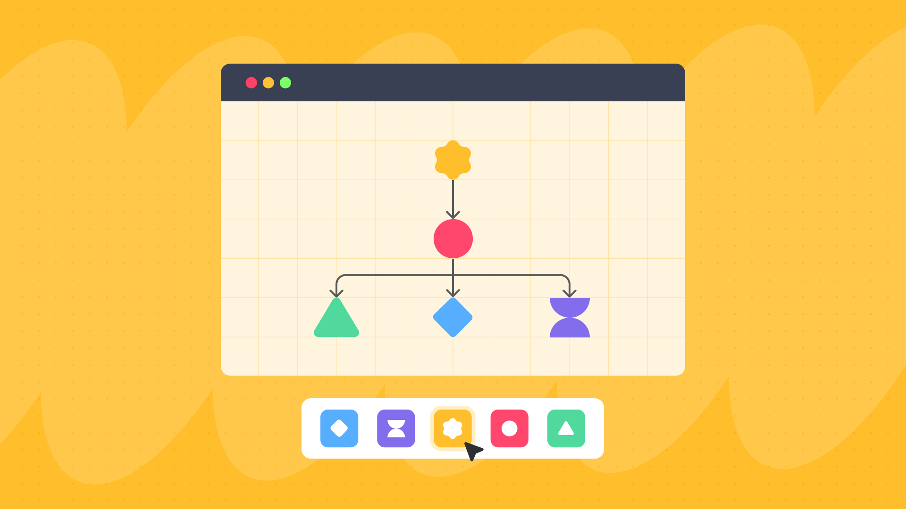
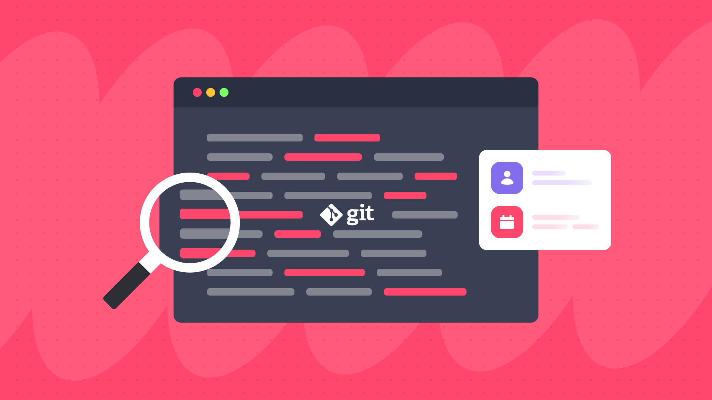

<div align="center">
  <a href="https://www.berryjam.dev/" target="_blank">
    <picture>
      <source media="(prefers-color-scheme: dark)" srcset="./assets/img/berryjam_logo_dark.png" width="500">
      
    </picture>
  </a>
</div>

<h1 align="center">UI Components Anaylzer for Vue 3 & Nuxt</h1>

<div align="center">
  Scan your Vue.js codebase for component visibility and actionable insights.
</div>  
<br/>

<div align="center">
  
  [Issues](../../issues) - [Join our Discord][discord] - [License](#page_facing_up-license) - [Berryjam Cloud][berryjam]
  
  Available for: Vue.js (3.X), Nuxt (3.X)

  [](https://www.npmjs.com/package/berryjam)
  [](/LICENSE.md)
  [][discord]
  [][twitter] 
</div>


# :book: Table of Contents
1. [Why Berryjam](#star-why-berryjam)
2. [Features](#sparkles-features)
3. [Limitations](#see_no_evil-limitations)
4. [Getting Started](#rocket-getting-started)
5. [Development](#construction-development)
6. [Contributing](#muscle-contributing)
7. [Need Help?](#raising_hand-need-help)
8. [License](#page_facing_up-license)
9. [Acknowledgement](#acknowledgement)

# :star: Why Berryjam

<!-- TODO: Video Demo of Running on Terminal -->

Berryjam provides a simple way to identify your component usage, props and their relationships. Based on the output from your scan, you can create your own dashboard and run analysis across your project components to improve communications across your development team.

# :sparkles: Features
<table>
  <tr>
    <td><p>1. Scan your project for components</p></td>
    <td><p>2. Analyze components and their relationships</p></td>
  </tr>
  <tr>
    <td><p>3. Scan Git log for author and datetime</p></td>
    <td><p>4. Automatically detect props for each component</p></td>
  </tr>
</table>

# :see_no_evil: Limitations

- Berryjam is not compatible with Vue 2 or lower versions. 

- Berryjam has been fully tested to work with node version from `16.0` to `18.17.1 (LTS)`. Versions above `18.17.1 (LTS)` should work as well but have not been fully tested.

# :rocket: Getting Started

## Install Berryjam

There are a few ways you can install Berryjam, namely npm, pnpm and yarn. If you install via npm, here is a single cmd to install this library

```sh
  npm install berryjam
```

#### Other options

- pnpm

```sh
  pnpm add berryjam
```

- yarn

```sh
  yarn add berryjam
```

## Usage

To start scanning your project, you will first need to import `VueScanner` class and create its instance.

```typescript
import { homedir } from 'os';
import VueScanner from "berryjam"
import type { VueScannerOption, ComponentProfile } from "berryjam"
...
const pathToScan = '../your-vue-project-path';
const option: VueScannerOption = {
  // this folder will be used to store the exact versions of babel & vue compiler
  appDir: `${homedir()}/.vueScanner`,
  // ... any other options
}
// Create a new VueScanner instance with the required parameters
const vueScanner = new VueScanner(pathToScan, option);
...
// To start scanning without async/await
vueScanner.scan().then(result => {
  // the result will be an array of ComponentProfile
  // log to see the result
  console.log(result);
})

// or, You can use async/await
async function whatEverFunction() {
  const result = await vueScanner.scan();
}


```

The `VueScanner` function takes two parameters as follow: 
- The first parameter is the path of the project to be scanned.
- The second is an options object that utilizes the `VueScannerOption` interface.

Here is a detailed description of each available option within the `VueScannerOption` interface:

### VueScannerOption Interface

| Property   | Type                     | Description                                                         |
|------------|--------------------------|---------------------------------------------------------------------|
| `appDir`   | `string`                 | The path of the project directory to be scanned.                    |
| `output`   | `OutputFormat` (optional)| The desired output format of the scanned result. (JSON by default)  |
| `ignore`   | `string[]` (optional)    | An array of file names or directory names to exclude from scanning. |
| `verbose`  | `boolean` (optional)     | Enable verbose mode for more detailed scanning information.         |
| `debug`    | `boolean` (optional)     | Operate the scanner in debug mode, providing debugging information. |

### OutputFormat Type

The `OutputFormat` type represents available output formats.

| Type       | Description                                                                                         |
|------------|-----------------------------------------------------------------------------------------------------|
| `"json"`   | Output the scanned result in JSON format and saved as 'component-profiles.json' within the 'appDir'.|
| `"stdout"` | Display the scanned result directly in the console (stdout).                                        |

These options and types offer flexibility and customization when using the `VueScanner` function to analyze Vue.js projects.

For more details on `VueScanner` class, please check out [below](#VueScanner-Overview).

### Output

By calling the `scan` method, it will scan for Vue components and return `ComponentProfile[]`. Here is an example of how it may look. For demonstration purposes, we have scanned an open-source project called [Koel](https://github.com/koel/koel).

<details open>
  <summary>Sample Result</summary>

```json
[
  {
    "name": "PlaybackControls",
    "type": "internal",
    "total": 1,
    "source": {
      "path": "/resources/assets/js/components/layout/app-footer/FooterPlaybackControls.vue",
      "property": {
        "dataLastModified": "Sun Feb 04 2018",
        "lastModified": "Sun Feb 04 2018",
        "created": "2018-02-02T21:12:19.000Z",
        "createdBy": "Phan An",
        "updatedBy": "Phan An"
      }
    },
    "usageLocations": [
      {
        "name": "PlaybackControls",
        "source": "/resources/assets/js/components/layout/app-footer/FooterPlaybackControls.vue",
        "destination": "/resources/assets/js/components/layout/app-footer/index.vue",
        "rows": [
          9
        ],
        "fileInfo": {
          "path": "/resources/assets/js/components/layout/app-footer/FooterPlaybackControls.vue",
          "property": {
            "dataLastModified": "Sun Feb 04 2018",
            "lastModified": "Sun Feb 04 2018",
            "created": "2018-02-02T21:12:19.000Z",
            "createdBy": "Phan An",
            "updatedBy": "Phan An"
          }
        }
      }
    ],
    "children": {
      "total": 4,
      "tags": [
        "LikeButton",
        "icon",
        "PlayButton",
        "RepeatModeSwitch"
      ],
      "source": "/resources/assets/js/components/layout/app-footer/FooterPlaybackControls.vue"
    }
  },
  {
    "name": "PlayButton",
    "type": "internal",
    "total": 1,
    "source": {
      "path": "/resources/assets/js/components/ui/FooterPlayButton.vue",
      "property": {
        "dataLastModified": "Sun Feb 04 2018",
        "lastModified": "Sun Feb 04 2018",
        "created": "2018-02-02T21:12:19.000Z",
        "createdBy": "Phan An",
        "updatedBy": "Phan An"
      }
    },
    "usageLocations": [
      {
        "name": "PlayButton",
        "source": "/resources/assets/js/components/ui/FooterPlayButton.vue",
        "destination": "/resources/assets/js/components/layout/app-footer/FooterPlaybackControls.vue",
        "rows": [
          11
        ],
        "fileInfo": {
          "path": "/resources/assets/js/components/ui/FooterPlayButton.vue",
          "property": {
            "dataLastModified": "Sun Feb 04 2018",
            "lastModified": "Sun Feb 04 2018",
            "created": "2018-02-02T21:12:19.000Z",
            "createdBy": "Phan An",
            "updatedBy": "Phan An"
          }
        }
      }
    ],
    "children": {
      "total": 1,
      "tags": [
        "icon"
      ],
      "source": "/resources/assets/js/components/ui/FooterPlayButton.vue"
    }
  },
]
```

</details>

# :construction: Development

The library uses `Nodejs`, `TypeScript` and `Jest` for development. Since this is a tool for detecting Vue components, you may find the rules on how Vue components in the [built-in-rules](/documentation/built-in-rules) folder.

## How It Works

Berryjam contains 2 classes, namely:

1. `VueScanner` - Use to scan a project for component profiles. It will extract relevant relative values such as source, file path, component name from package.json files and their respective supported files to transform or normalize raw component data which will be mapped to each component profile.

2. `GitService` - If the project has .git folder, it will look for git related information such as author and datetime and map to each component profile.

### VueScanner Overview

Within the `VueScanner` class, you may call on `scan()` method to start scanning. The method encompasses 5 main steps. There are as follow:


| Step                                        | Description                                                                                                                                                                                                     |
|---------------------------------------------|-----------------------------------------------------------------------------------------------------------------------------------------------------------------------------------------------------------------|
|1. `Group by Related Package.Json`           | Since there are multiple package.json files and supported files (`.vue`, `.js`, `.jsx`, `.ts`, `.tsx` and all files from the `.nuxt` folder (if any)), the system will group and determine the source of origin |
|2.  `Select Analyzer Lib`                    | To choose the right library that matches the Vue version of your project                                                                                                                                        |
|3.  `Prepare Alias Paths`                    | To gather all aliases from TS, JS and Vite config files to use for replacement in the 'import' statements                                                                                                       |
|4.  `Analyze Component Files`                | For each file extension, the system will gather component info, including props                                                                                                                                 |
|5. `Optimize Analyzed Results`               | Based on the component info, improvements are made by removing duplicates and formatting the component profile in a more structured way                                                                         |

### GitService Overview

Below are the main methods in the `GitService` class:

| Method       | Description                                                                          |
| ------------ | ----------------------------------------------------------------------------------   |
| `gitScanner` | Initiate git log shell commands to scan which will be used by `gitMapping`.          |
| `gitMapping` | Using the result from `gitScanner` to compare component name and git log filename. If both match, the git information will update into the respective component profile. |

### Dependencies

Third-Party plugins are loaded automatically from Berryjam’s package.json

- Code Parsers
  - [Babel](https://babeljs.io/)
  - [Vue](https://www.npmjs.com/package/vue?activeTab=dependencies)
- Node Modules
  - path
  -  fs
- Others
  - [glob](https://www.npmjs.com/package/glob)
  - [lodash](https://www.npmjs.com/package/lodash)
  - [tsconfig-paths](https://www.npmjs.com/package/tsconfig-paths)

For more information, please refer to the [documentation](/documentation) folder.

# :muscle: Contributing

We are thankful and appreciative for all types of contributions. Whether you are helping us report or fix bugs, proposing new features, improving our documentation or spreading the word - we would love to have you as a part of the Berryjam community. Please refer to our [Contributing Guide](/CONTRIBUTING.md) and [Code of Conduct](/CODE_OF_CONDUCT.md).

If you wish to start contributing right away, navigate to the GitHub [Issues](../../issues) tab and start looking through interesting issues. You may start off by working on issues labeled under `documentation` and `good first issue`.

If you run into an error or an issue while using Berryjam, you have an idea on how to better Berryjam or perhaps you are looking through the documentation and thinking that it could be improved... please don’t hesitate to submit an issue :sunglasses:

If you are a Vue.js developer who is not familiar with Node.js., you can submit an issue labeled `code example` on how you create Vue components. Check out our [built-in-rules](/documentation/built-in-rules) for more details.

# :raising_hand: Need Help?

We are more than happy to help you. If you have any questions, run into any errors or face any problems, please feel free to ask for help in [Berryjam Discord][discord]. Anything related to Berryjam is on the table!

# :page_facing_up: License

Berryjam is distributed under MIT License. Please refer to our [LICENSE.md](/LICENSE.md) file for more details.

# Acknowledgement

- [Babel](https://babeljs.io/)
- [Glob](https://www.npmjs.com/package/glob)
- [Img Shields](https://shields.io)
- [lodash](https://github.com/lodash/lodash)
- [Node.js](https://nodejs.org/en)
- [Tsconfig-Paths](https://github.com/dividab/tsconfig-paths)
- [Vue.js](https://vuejs.org/)

[discord]: https://discord.gg/8SgTS4QdCd
[twitter]: https://twitter.com/Berryjamdev
[berryjam]: https://www.berryjam.dev
