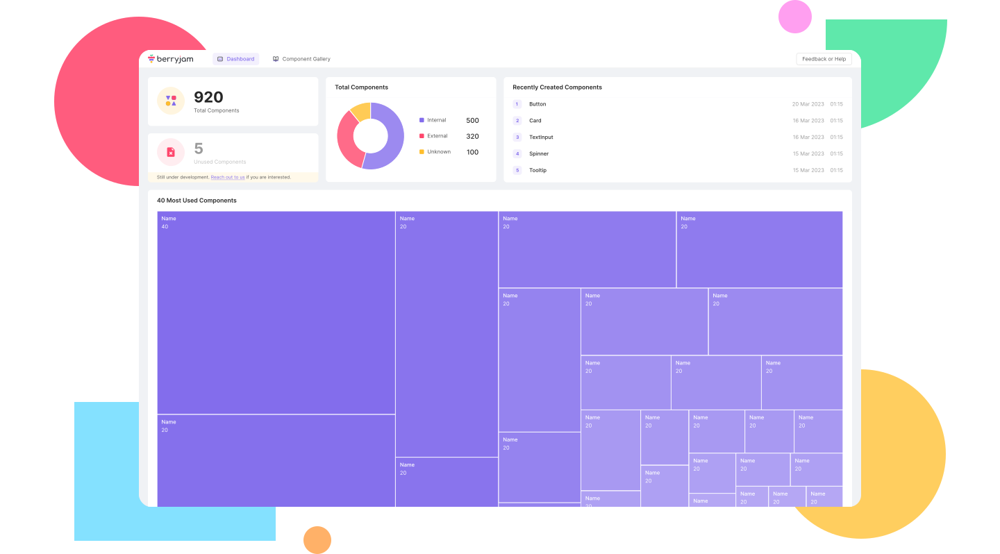

<div align="center">
  <a href="https://www.berryjam.dev/" target="_blank">
    <picture>
      <source media="(prefers-color-scheme: dark)" srcset="./assets/img/berryjam_logo_dark.png" width="500">
      
    </picture>
  </a>
</div>

<h1 align="center">UI Components Anaylzer for Vue 3 & Nuxt</h1>

<div align="center">
  Scan your Vue.js codebase for component visibility and actionable insights.
</div>

<p align="center">
  <br/>
  <a href="https://docs.berryjam.dev" rel="dofollow"><strong>Explore the docs »</strong></a>
  <br />
</p>

<div align="center">
  
  [Quick Start](#rocket-quick-start) - [Community](#busts_in_silhouette-community) - [Support (to Berryjam Discord)][discord] - [License](#books-license)
  
  Available in: Vue.js (3.X), Nuxt (3.X)

  [](https://www.npmjs.com/package/berryjam)
  [](LICENSE.md)
  [][discord]
  [][twitter] 
</div>

## :sparkles: Overview
Berryjam is a Vue.js component analytics tool to scan your project for components to monitor their usage. Component visibility allows for effective team communication and provides opportunities to optimize your source code.

## :rocket: Quick Start

### Scan with Berryjam CLI - Cloud

First, you will need to create a [Berryjam account](https://app.berryjam.dev/register) and workspace. After that, please choose a project you would like to scan. For demonstration purposes, we will be scanning an open-source project called [Koel](https://github.com/koel/koel). Clone or download it to a convenient location to get started.

```sh
git clone https://github.com/koel/koel.git
```

Now, login with your Berryjam account on your preferred terminal. You will be prompted to input email and password.

```sh
npx berryjam@latest login
```

Then, run the scan command with Berryjam scan on the project root directory:

```sh
npx berryjam@latest scan .
```

The terminal will prompt you to install Berryjam CLI (latest version). After that, the CLI will prompt you to confirm the workspace you wish to scan to. Once the scan is complete, Berryjam CLI will provide your workspace URL to click on.

### Scan with Berryjam CLI - Offline

Because we will be installing and running Berryjam CLI in a single command, please choose a project you would like to scan. For demonstration purposes, we will be scanning an open-source project called [Koel](https://github.com/koel/koel). Clone or download it to a convenient location to get started.

```sh
git clone https://github.com/koel/koel.git
```

Now, run the scan command with Berryjam scan on the project root directory:

```sh
npx berryjam@latest scan . --local
```

The terminal will prompt you to install Berryjam CLI (latest version). Once the scan is complete, Berryjam CLI will automatically open a localhost web app. By default, the port is configured for port 3000. If it is unavailable, please change your port with this [command](https://docs.berryjam.dev/cli.html#scan-to-local).
<br/>
Berryjam will scan for components in your source code and output a JSON file.

<details>
  <summary>Simple JSON</summary>

```javascript
[
    {
        tag: "Overlay",
        total: 1,
        type: "internal",
        source: {
            filePath: "@/components/ui/Overlay.vue",
            fileProperty: {
                dataLastModified: "",
                lastModified: "",
                created: "",
                createdBy: "",
                updatedBy: ""
            }
        },
        details: [
            {
                source: "/Users/name/folder/koel-master/resources/assets/js/App.vue",
                rows: [2],
                property: {
                    dataLastModified: "",
                    lastModified: "",
                    created: "",
                    createdBy: "",
                    updatedBy: ""
                },
                total: 1,
            },
        ],
        children: {
            total: 0,
            tags: [],
            source: "",
        },
    },
    {
        tag: "DialogBox",
        total: 1,
        type: "internal",
        source: {
            filePath: "@/components/ui/DialogBox.vue",
            fileProperty: {
                dataLastModified: "",
                lastModified: "",
                created: "",
                createdBy: "",
                updatedBy: ""
            }
        },
        details: [
            {
                source: "/Users/name/folder/koel-master/resources/assets/js/App.vue",
                rows: [3],
                property: {
                    dataLastModified: "",
                    lastModified: "",
                    created: "",
                    createdBy: "",
                    updatedBy: ""
                },
                total: 1,
            },
        ],
        children: {
            total: 0,
            tags: [],
            source: "",
        },
    },
];
```

</details>
After the scan, an Analytic Dashboard is generated for transparency and insights. Here is a sample Dashboard:



## :busts_in_silhouette: Community

- [Twitter][twitter]: Follow our official Twitter account
- [Discord][discord]: A place where you can get support, feedback or just want to meet and hang out.
- [GitHub](https://github.com/logicspark/berryjam): If you wish, you may want to request features here too.
- For any other inquiries, you may reach out to us at connect@berryjam.dev.

## :books: License

Berryjam code is licensed under the terms of the [Elastic License 2.0](LICENSE.md) (ELv2), which means you can use it freely inside your organization to protect your applications without any commercial requirements.

You are not allowed to provide Berryjam to third parties as a hosted or managed service without explicit approval.


[discord]: https://discord.gg/8SgTS4QdCd
[twitter]: https://twitter.com/Berryjamdev
[documentation]: https://docs.berryjam.dev
